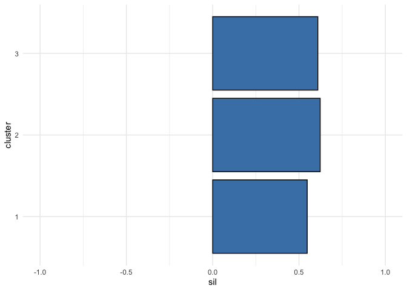
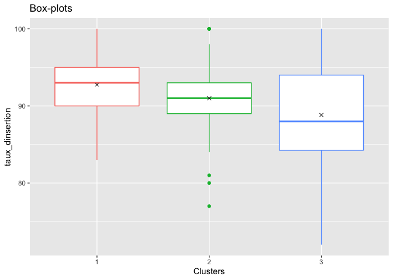
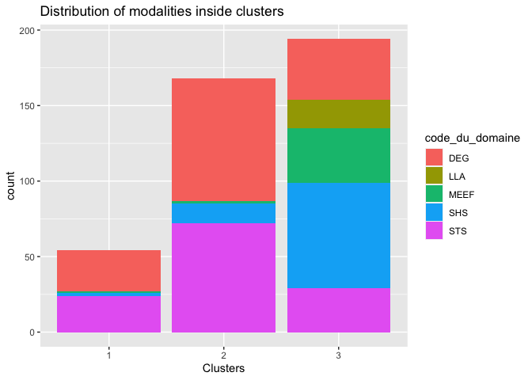
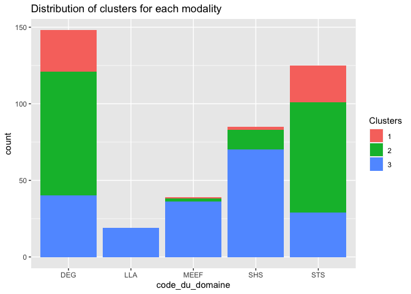
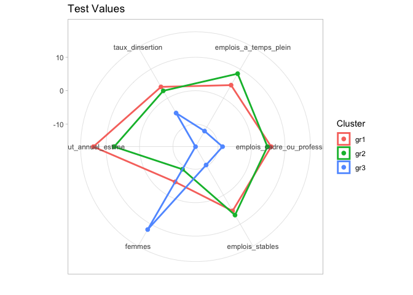
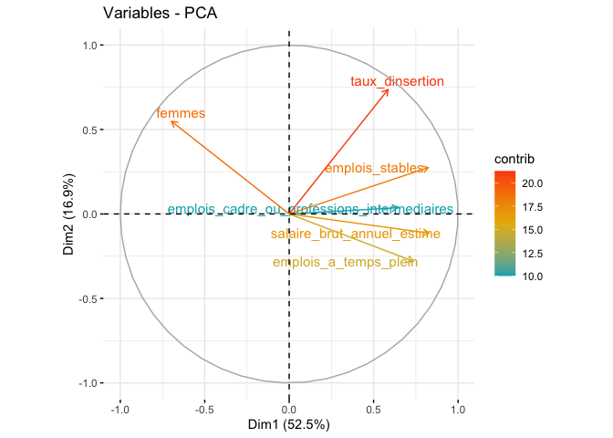
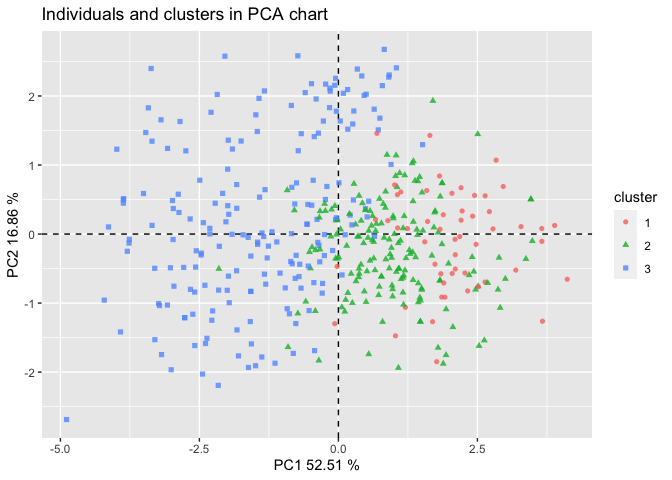

Intro
-----

The goal of this tutorial is to show how to use the charclust package
and interpret the results.  
The dataset for this example is "insertion\_master" which is provided
with the package. but du clustering methodes des kmeans avec 3 classes

    library(charclust)
    data(insertion_master)
    data.illu <- insertion_master[,c(1:6,12)]
    data.act <-insertion_master[,7:11]
    res.kmeans<-kmeans(data.act,centers=3,nstart=5)

Creation de l'objet
-------------------

explications ....

    obj <- objcharac(insertion_master, data.act, data.illu, res.kmeans$cluster)

Evaluation du clustering
------------------------

### DB

    db <- db_index(obj)
    print(db)

    ##  DB Index 
    ## 0.6033811

bof on va regarder un autre indicateur \#\#\# Silhouette expliquer en
quoi consiste l'indice

    silhouette <- sil(obj)
    print(silhouette$silglob)

    ## [1] 0.5930815

il est pas mal regardons par clusters

    print(silhouette$silclus)

    ##         1         2         3 
    ## 0.5475537 0.6226540 0.6090367

    silhouette$plot

 classe 2
legerement moins bien classé mais globalement idem

Caractérisation univariée
-------------------------

expliquer vite fait on va d'abord visualiser

    graph_uni_act <- charac_graph(obj, type = "act", profile = "l")
    graph_uni_act$taux_dinsertion

 hierarchie
du taux d'insertion groupe 2 &gt;&gt;&gt; groupe 3 &gt;&gt;&gt; groupe 1

    graph_uni_illus <- charac_graph(obj, type = "illus", profile = "l")
    graph_uni_illus$code_du_domaine

    graph_uni_illus2 <- charac_graph(obj, type = "illus", profile = "c")
    graph_uni_illus2$code_du_domaine

    univariate = charac_uni(obj)
    print(univariate)

    ## $taux_dinsertion
    ##       G 1       G 2       G 3    % epl. 
    ## 92.759259 90.988095 88.824742  7.517836 
    ## 
    ## $emplois_cadre_ou_professions_intermediaires
    ##      G 1      G 2      G 3   % epl. 
    ## 93.68519 88.82738 81.07216 20.18582 
    ## 
    ## $emplois_stables
    ##      G 1      G 2      G 3   % epl. 
    ## 83.55556 79.77381 66.88660 26.96383 
    ## 
    ## $emplois_a_temps_plein
    ##      G 1      G 2      G 3   % epl. 
    ## 97.92593 97.36310 88.36598 31.14120 
    ## 
    ## $salaire_brut_annuel_estime
    ##         G 1         G 2         G 3      % epl. 
    ## 35322.22222 30773.21429 26122.16495    84.37342 
    ## 
    ## $diplome
    ##         khi2      p_value       cramer 
    ## 3.609294e+01 1.453840e-08 2.945537e-01 
    ## 
    ## $etablissement
    ##         khi2      p_value       cramer 
    ## 2.516395e+02 3.312681e-09 5.499557e-01 
    ## 
    ## $academie
    ##         khi2      p_value       cramer 
    ## 1.269567e+02 8.238328e-08 3.906306e-01 
    ## 
    ## $code_du_domaine
    ##         khi2      p_value       cramer 
    ## 1.488700e+02 3.373612e-28 4.230015e-01 
    ## 
    ## $domaine
    ##         khi2      p_value       cramer 
    ## 1.488700e+02 3.373612e-28 4.230015e-01 
    ## 
    ## $discipline
    ##         khi2      p_value       cramer 
    ## 2.022341e+02 8.239040e-26 4.930211e-01 
    ## 
    ## $femmes
    ##      G 1      G 2      G 3   % epl. 
    ## 47.12963 48.06548 70.73711 34.06873

    print(univariate$taux_dinsertion)

    ##       G 1       G 2       G 3    % epl. 
    ## 92.759259 90.988095 88.824742  7.517836

    print(univariate$code_du_domaine)

    ##         khi2      p_value       cramer 
    ## 1.488700e+02 3.373612e-28 4.230015e-01

    vtest = testval(obj)
    #print result for numeric variables
    tquanti <- vtest$num[[1]]
    print(tquanti)

    ##        taux_dinsertion emplois_cadre_ou_professions_intermediaires
    ## G 1 vt        3.902054                                    5.878595
    ## G 2 vt        2.539999                                    4.768985
    ## G 3 vt       -5.127112                                   -8.651083
    ##        emplois_stables emplois_a_temps_plein salaire_brut_annuel_estime
    ## G 1 vt        5.430371              4.506094                  13.793643
    ## G 2 vt        6.866863              8.449083                   7.572277
    ## G 3 vt      -10.412509            -11.346030                 -16.740760
    ##           femmes
    ## G 1 vt -4.570777
    ## G 2 vt -8.939882
    ## G 3 vt 11.872340

    vtest$graph

    #print result for qualitative variables
    tquali <- vtest$num[[2]]
    #print(tquali)
    #print result for one qualitative variable
    print(tquali$domaine)

    ##   Droit, economie et gestion Lettres, langues, arts Masters enseignement
    ## 1                   4.560795             -0.9749608            -1.691125
    ## 2                   3.996125             -0.9749608            -1.839795
    ## 3                  -4.730061              1.1156768             2.063950
    ##   Sciences humaines et sociales Sciences, technologies et sante
    ## 1                     -4.283108                        4.192541
    ## 2                     -3.250187                        3.730284
    ## 3                      4.006800                       -4.397345

Caractérisation multivariée
---------------------------

    pca <- charac_graph(obj, type = "pca")
    pca$var

    pca$ind

### ADL

    lda = clustlda(obj)
    #print(lda$coef_LDA)
    #the confusion matrix
    print(lda$confusion_matrix)

    ##      
    ## ytest  1  2  3
    ##     1 14  2  0
    ##     2  0 37  0
    ##     3  0  2 49

    #the model evaluation
    print(lda$eval)

    ##                                           var     FValue   pvalue
    ## 1                             taux_dinsertion   4.164302 0.016433
    ## 2 emplois_cadre_ou_professions_intermediaires   2.050221 0.130477
    ## 3                             emplois_stables   3.456044 0.032795
    ## 4                       emplois_a_temps_plein   9.104840 0.000144
    ## 5                  salaire_brut_annuel_estime 444.820354 0.000000
